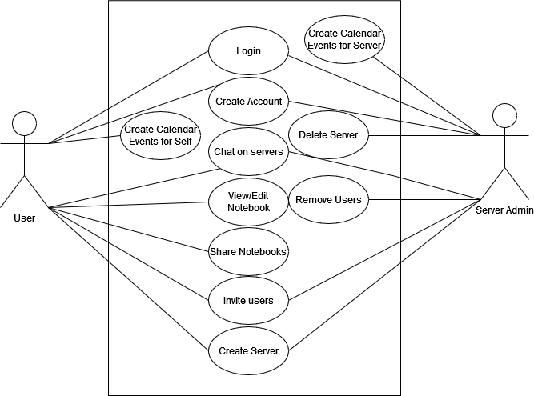

# Detailed Design Document
# VOX - Realtime Groupchat App

February 24, 2023

Version 1

**Presented to**  
Dr Schwesinger

**Submitted By:**  
Hamad Ahmed  
Gabe Leffew  
Jesse Fullington  
Benjamin Lloyd  

## Revision History
| Date Created  | Version # |
| ------------- |:---------:|
| 2/15/2023     | 1         |

## 1.0 Introduction
Our goal is to create a centralized location for collaboration in the classroom setting and beyond. Schedule events for your team and find the best team to tackle your toughest goals. Save notes for classes and share with your group to always be on the same page. Manage your groups and create a hierarchy as you see fit, whether you want one to rule them all or total anarchy. Create servers for any group like a club, a group of friends, or your tri-annual family reunion.

## 1.2 Scope

### Personas

- I am a college student who always forgets my due dates and can’t communicate effectively with my team members. If only there was one spot to see all this information, I would excel in my academic career.

- I am a football coach and can’t keep up with my rowdy team. Some of my dogs forget to come to practice sometimes and other times they don't hand in their chicken barbecue fundraisers. I need a place to collaborate with my team and help my boys succeed.

## 2.0 Related Documents
- [Requirements Traceability Matrix](./Requirements_Traceability_Matrix.xlsx)
- [Software Requirements Specification](./software_requirements.md)

## 3.0 Design
- 
### 3.1 Component Diagram

### 3.2 Entity Relationship Diagram
- [Entity Relationship Diagram](./Design%20Files/er_diagram.drawio)

#### 3.2.2 What methods are used to setup the database?
- To access the database, external software are available for this purpose. The software is utilizing is called DB Browser (SQLite). This provide us with a user interface that allows us to look at the tables. Moreover, sql queries can also be inputted to manipulate data. To run our application, the command "flask init-db" has to be executed in order to initialize the database. This is how it works with flask, a python's web framework.
### 3.3 Major Use Cases
#### 3.3.1 Create Account
- Story: I want to identify myself within the application. Creating an account is a way to fullfil this.
- Description: 
- Preconditions: none
- Postconditions: User gets access to the homepage screen
- Design Details:
- Constraints:
- Assumptions:

#### 3.3.2 User Login
- Story: To keep using the application more than time, you can login into your account and be back where you left off.
- Description:
- Preconditions: Must have an existing account
- Postconditions: none
- Design Details:
- Constraints:
- Assumptions:

#### 3.3.3 Create Vox Server
- Story:
- Description:
- Preconditions: Must have an existing account
- Postconditions: Server is established, User becomes the server admin of the created server.
- Design Details:
- Constraints:
- Assumptions:

#### 3.3.4 Chat on Servers
- Story:
- Description:
- Preconditions: Must have/be in a server
- Postconditions: None
- Design Details:
- Constraints:
- Assumptions:

#### 3.3.5 View/edit notebook
- Story:
- Description:
- Preconditions: Must have an account and be a part of a server
- Postconditions: Save notebook if changes were made
- Design Details:
- Constraints:
- Assumptions:

#### 3.3.6 Calendar
##### 3.3.6.1 Create event
- Story:
- Description:
- Preconditions: Must have an account
- Postconditions: Event is added to calendar
- Design Details:
- Constraints:
- Assumptions:

##### 3.3.6.2 Remove event 
- Story:
- Description:
- Preconditions: Must have an existing event
- Postconditions: Event is deleted from calendar
- Design Details:
- Constraints:
- Assumptions:

#### 3.3.8 Remove Users
- Story:
- Description:
- Preconditions: Have users in a server
- Postconditions: remove user from record of server
- Design Details:
- Constraints:
- Assumptions:

#### 3.3.9 Delete Server
- Story: No one uses my server anymore and there is no point of having it so I want to get rid of it.
- Description: The admin of the server will select the settings option in the top right hand corner of their server page; once there they will be able to select `Delete Server` and will be prompted with a window to confirm this deletion. 
- Preconditions: Be an admin of the server
- Postconditions: deletes the server 
- Design Details: 
- Constraints: 
- Assumptions: 

    

#### 3.3.10 Invite users to server
- Story: I want to invite my friends to the server to chat with them.
- Description: The admin of the server will select the settings option in the top right hand corner of their server page; Once there they will be able to select `Invite Users` and will be prompted with an input to enter a users name. 
- Preconditions: Must have received a code 
- Postconditions: Sends invite notification to user asking them to join the server. 
- Design Details:
- Constraints:
- Assumptions:

    
### 3.4 Minor Use Cases
#### 3.4.1 Configure server permissions
- Story:
- Description:
- Preconditions: None
- Postconditions: The server preferences will be updated if anything changed.
- Design Details:
- Constraints:
- Assumptions:

#### 3.4.2 Set preferences/settings
- Story:
- Description:
- Preconditions: Must have an account
- Postconditions: Changes are saved if any were made
- Design Details:
- Constraints:
- Assumptions:

## 4.0 Systems
### 4.1 Architecture
Note: Remove these directions and replace with content
- diagram of architecture 
- description of overall architecture and what is running on each component 
- identify development, staging, and production environments 
- scripts to deploy to staging & production 

## 5.0 Non Functional Requirements
### 5.1 SSL Certificate
*Certificate is currently pending*

### 5.2 Performance Criteria
We would like to support up to 10 concurrent users. We believe this is enough to demonstrate the features listed and provide a better proof of concept before scaling the application would be required.