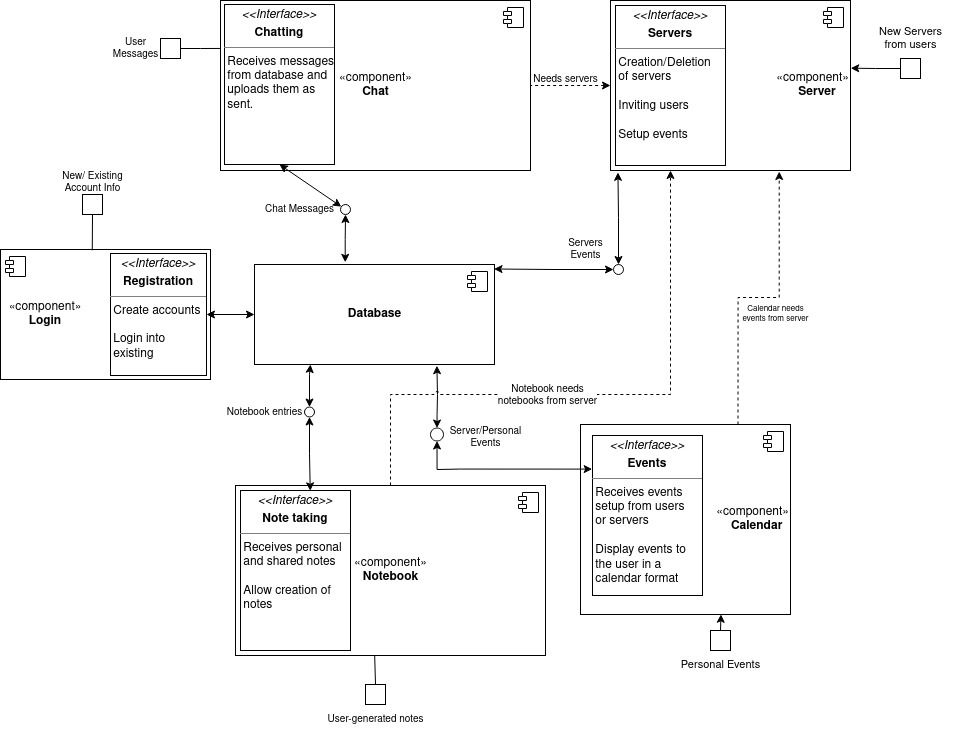
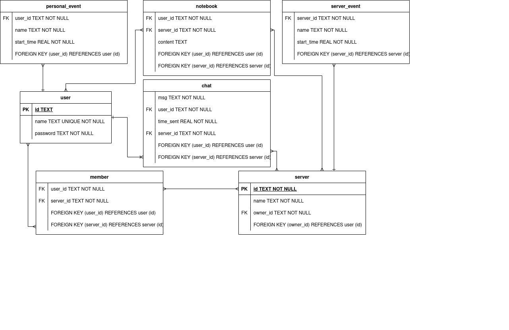

# Detailed Design Document
# VOX - Realtime Groupchat App

February 24, 2023

**Version** 1

**Presented to**  
Dr Schwesinger

**Submitted By:**  
Hamad Ahmed  
Gabe Leffew  
Jesse Fullington  
Benjamin Lloyd  

## Revision History
| Date Created  | Version # |
| ------------- |:---------:|
| 2/15/2023     | 1         |

## 1.0 Introduction
Our goal is to create a centralized location for collaboration in the classroom setting and beyond. Schedule events for your team and find the best team to tackle your toughest goals. Save notes for classes and share with your group to always be on the same page. Manage your groups and create a hierarchy as you see fit, whether you want one to rule them all or total anarchy. Create servers for any group like a club, a group of friends, or your tri-annual family reunion.

## 1.2 Scope

### Personas

- I am a college student who always forgets my due dates and can’t communicate effectively with my team members. If only there was one spot to see all this information, I would excel in my academic career.

- I am a football coach and can’t keep up with my rowdy team. Some of my dogs forget to come to practice sometimes and other times they don't hand in their chicken barbecue fundraisers. I need a place to collaborate with my team and help my boys succeed.

## 2.0 Related Documents
- [Requirements Traceability Matrix](./Requirements_Traceability_Matrix.xlsx)
- [Software Requirements Specification](./software_requirements.md)

## 3.0 Design
### 3.1 Component Diagram

### 3.2 Entity Relationship Diagram

### 3.3 Major Use Cases
#### 3.3.1 Create Account
- Story: I want to identify myself within the application. Creating an account is a way to fullfil this.
- Description: User goes on to the website for the first time. To acccess the features, an account must be created. The user would hit ceate account button, and fill out the information with valid input. After that, user get access to the homepage.
- Preconditions: none
- Postconditions: User gets access to the homepage screen
- Design Details: Do not forget to enter valid account information.
- Constraints: Can only enter alphanumeric characters for username.
- Assumptions: none  
)

#### 3.3.2 User Login
- Story: To keep using the application more than time, you can login into your account and be back where you left off.
- Description: User visits the website after they already have an account. User would hit the login button, and enter their account information to log in. Then, they would taken to the homepage.
- Preconditions: Must have an existing account
- Postconditions: none
- Design Details: Enter your valid account information
- Constraints: none
- Assumptions: none  

#### 3.3.3 Create Vox Server
- Story: To interact with another user, both users need to be in the same server. One user needs to create a server or be invited to one. If the user wants to be a server admin, a server must be created. Moreover, the first user of the application must create a server.
- Description: After the user logs in to their account, they will arrive at the homepage. On the left panel, the user would click create server button, and be taken to the create server page. Then, the user fills the information with the valid information. Then, a server is created.
- Preconditions: Must have an existing account
- Postconditions: Server is established, User becomes the server admin of the created server. 
- Design Details: Do not forget to enter a valid server name.
- Constraints: Can only enter alphanumeric characters for server name.
- Assumptions: A unique server admin is created and stored in the database.  

#### 3.3.4 Chat on Servers
- Story:
- Description:
- Preconditions: Must have/be in a server
- Postconditions: None
- Design Details:
- Constraints:
- Assumptions:

#### 3.3.5 Notebook
##### 3.3.5.1 View/edit notebook
- Story: I wish I could be more organized. I've been stuffing my bookbag with loose papers and I lose them regularly. I may have to drop out of college because of this. If only they could be kept in a centralized digital location.
- Description: A user may create a notebook for each server they are in. The contents would be saved in the cloud so they can access it anywhere they go.
- Preconditions: Must have an account and be a part of a server
- Postconditions: Save notebook if changes were made
- Design Details: User has a seperate notebook for each server they are part of. The notebook should be able to be saved manually. Optionally auto save the notebook after a few seconds of no new changes.
- Constraints: 1 notebook per server for each individual user.
- Assumptions: None  

##### 3.3.5.2 Share notebook
- Story: My classmate missed class and didn't get the notes. Since we are in the same server for the class I would like to be able to share the notes with them.
- Description: A user of a server may share their notebook with other users of the same server. This would be viewable in a column that would show who all in the server shares their notes and the user would be able to choose any of them.
- Preconditions: Must have an account and be a part of a server && Notebook must be shared with server.
- Postconditions: None
- Design Details: A user viewing a shared notebook may not make edits to the notebook, READ ONLY. 
- Constraints: Only owner of notebook may edit the notebook, shared users may only view notes
- Assumptions: None  

#### 3.3.6 Calendar
##### 3.3.6.1 Create event
- Story:
- Description:
- Preconditions: Must have an account
- Postconditions: Event is added to calendar
- Design Details:
- Constraints:
- Assumptions:

##### 3.3.6.2 Remove event 
- Story:
- Description:
- Preconditions: Must have an existing event
- Postconditions: Event is deleted from calendar
- Design Details:
- Constraints:
- Assumptions:

#### 3.3.8 Remove Users
- Story: There is someone being a nuisance in my server. It is distracting the other users from excelling in their academic career. As a teacher, I need a way to get these hooligans out.
- Description: There should be the ability to remove a user from a server and possibly prevent them from being able to rejoin.
- Preconditions: Have users in a server and be the owner of the server 
- Postconditions: remove user from record of server
- Design Details: Admins should be the only ones allowed to remove users. The removed users should be banned and therefore not allowed to rejoin.
- Constraints: None
- Assumptions: None  

#### 3.3.9 Delete Server
- Story: No one uses my server anymore and there is no point of having it so I want to get rid of it.
- Description: The admin of the server will select the settings option in the top right hand corner of their server page; once there they will be able to select `Delete Server` and will be prompted with a window to confirm this deletion. 
- Preconditions: Be an admin of the server
- Postconditions: deletes the server 
- Design Details: This will delete the server and everything associated with it in the database.
- Constraints: Only the server creater can delete the server.
- Assumptions: None  

#### 3.3.10 Invite users to server
- Story: I want to invite my friends to the server to chat with them.
- Description: The admin of the server will select the settings option in the top right hand corner of their server page; Once there they will be able to select `Invite Users` and will be prompted with an input to enter a users name. 
- Preconditions: Must have received a code 
- Postconditions: Sends invite notification to user asking them to join the server. 
- Design Details: Users will have a notification button which is a socket constantly looking for new incoming notifications. 
- Constraints: Only users with an admin preference are able to invite other users to the server. This is iff the server is considered a `private` server.
- Assumptions: None  

### 3.4 Minor Use Cases
#### 3.4.1 Configure server permissions
- Story: My server is getting huge and trying to moderate it by myself has become too much to handle. I need a way to allow other people to have some power to moderate.
- Description: The server should be configurable to allow other users to have some abilities similar to the server owner.
- Preconditions: None
- Postconditions: The server preferences will be updated if anything changed.
- Design Details: The owner should be the only one able to add/remove priveleges. The configurable permissions are the ability to remove users.
- Constraints: The owner cannot be demoted by any lower priveleged member.
- Assumptions: None

## 4.0 Systems
### 4.1 Architecture
The architecture is defined in the SRS document.
- [Software Requirements Specification](./software_requirements.md/#50-architecture)

## 5.0 Non Functional Requirements
The nonfunctional requirements are defined in the SRS document.
- [Software Requirements Specification](./software_requirements.md/#40-non-functional-requirements)
