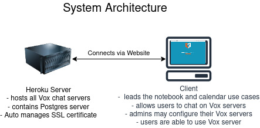

# Software Requirement Specifications
## Revision History
|Date Created|Author|Distributed to|Version|
|----|:----:|:-----------:|:-----:|
|2/15/2023|Team|Team & Supervisor|3|
|1/27/2023|Team|Team & Supervisor|3|
|12/8/2022|Team|Team & Supervisor|2|
|10/24/2022|Team|Team & Supervisor|1|

## 1.0 Introduction
Our goal is to create a centralized location for collaboration in the classroom setting and beyond. Schedule events for your team and find the best team to tackle your toughest goals. Save notes for classes and share with your group to always be on the same page. Manage your groups and create a hierarchy as you see fit, whether you want one to rule them all or total anarchy. Create servers for any group like a club, a group of friends, or your tri-annual family reunion.

The purpose of this document is to establish a common understanding between the development team and supervisor. Included are all our diagrams and documentation outlining what is needed to consider this a complete project. In turn, this document will be a single source of truth to make sure everyone is up to date on any changes. Along with requirements for project is also who will be responsible for what. This document may change, and revision will be noted above and tracked with Git to view previous information. 

### Scope

#### Use Case Diagram

- [Personas](./design_document.md#personas)

## 2.0 Related Documents
- [Software Development Plan](./design_document.md#vox)

### Responsibility Matrix
| Skills          | Hamad | Gabe | Ben | Jesse| 
| --------------- |:-----:|:----:|:---:|:----:|
| Git             | X | X | X | X
| Frontend        | X | X |   | 
| Backend         |   |   | X | X
| UI              |   |   | X | 
| Database (SQL)  | X | X | X | X
| HTML/CSS        | X | X |   | X
| Web server      | X | X | X | 

## 3.0 Requirements
#### As a user I want to:
- Create an account
- Login 
- Chat/Call on servers
- View/Edit Notebook
- Create Calendar Events
- Invite Users
- Create a Server
- Set preferences

#### As a server admin I want to:
- Do everything that a user can do 
- Configure my server's permissions
- Remove users from my server
- Delete my server

## 3.1 Punch list
The following items are still unresolved:
- Light/Dark theme selection 

## Use Cases
### 3.1 Create Account
- Actors: User
- Preconditions: none
- Flow of events:
  1. User enters data
  2. Data is validated
  3. Data is stored in a database
- Postconditions: User gets access to the homepage screen
- Requirements: If step 2 fails, account is not created with invalid data, create account form is cleared.
- Interface Requirements: A create account screen

### 3.2 User Login
- Actors: User and Server Admin
- Preconditions: Must have an existing account
- Flow of events:
  1. User inputs login information
  2. Input is validated 
  3. Data is stored in a database
- Postconditions: 
- Requirements: If step 2 fails, display wrong login and prompt to create an account 
- Interface Requirements: A login screen

### 3.3 Create Vox Server
- Actors: User and Server Admin
- Preconditions: Must have an existing account
- Flow of events:
  1. Enter information about the server.
  2. Data is validated
  3. Data is stored in a database
- Postconditions: Server is established, User becomes the server admin of the created server.
- Requirements: If the input is invalid, display an error message about what is invalid and try again.
- Interface Requirements: A server creator screen

### 3.4 Chat on Servers
- Actors: Users and Server Admin
- Preconditions: Must have/be in a server
- Flow of events:
  1. Select server
  2. Enter messages in chat box
  3. Receive messages
- Postconditions: None
- Requirements: None
- Interface Requirements: A server chatroom

### 3.5 View/edit notebook
- Actors: Users and Server Admin
- Preconditions: Must have an account and be a part of a server
- Flow of events:
  1. Open notebook to view content
  2. Make changes
  3. Share notebook with other users
- Postconditions: Save notebook if changes were made
- Requirements: None
- Interface Requirements: Server screen, and notebook screen

### 3.6 Calendar
- Actors: Users and Server Admin 

#### 3.6.1 Create event
- Preconditions: Must have an account
- Flow of events:
  1. Open calendar and view content
  2. User enters data for event 
- Postconditions: Event is added to calendar
- Requirements: None
- Other requirements: in order to invite users to an event, you must be in a server with them 
- Interface Requirements: Home page screen

#### 3.6.2 Remove event 
- Preconditions: Must have an existing event
- Flow of events:
  1. Select event
  2. Click to delete
  3. Confirm deletion 
- Postconditions: Event is deleted from calendar
- Requirements: To update all users invited to event
- Interface Requirements: Home page screen

### 3.7 Set preferences/settings
- Actors: User and Server Admin
- Preconditions: Must have an account
- Flow of events:
  1. Open settings menu
  2. Change settings
  3. Apply changes
- Postconditions: Changes are saved if any were made
- Requirements: Edit profile, application settings
- Interface Requirements: Settings screen

### 3.8 Configure server permissions
- Actors: Server Admin
- Preconditions: None
- Flow of events:
  1. Open server settings
  2. Configure settings
  3. Save settings
- Postconditions: The server preferences will be updated if anything changed.
- Requirements: None  
- Interface Requirements: Server configuration screen

### 3.9 Remove Users
- Actors: Server Admin
- Preconditions: Have users in a server
- Flow of events:
  1. Select user in server
  2. Delete user from server
  3. Confirmation on doing so
- Postconditions: remove user from record of server
- Requirements: None
- Interface Requirements: Server screen, message to confirm

### 3.10 Delete Server
- Actors: Server Admin
- Preconditions: None
- Flow of events:
  1. Go to settings
  2. Select to delete
  3. Confirmation to delete server, mention it is not reversible 
- Postconditions: deletes the server 
- Requirements: None
- Interface Requirements: Server screen, setting screen, message to confirm

### 3.11 Invite users to server
- Actors: User and Server Admin
- Preconditions: Must have received a code 
- Flow of events:
  1. Select the invite user option 
  2. Enter username of user to invite
- Postconditions: Sends invite notification to user asking them to join the server. 
- Requirements: If user does not exist, invite is not sent. 
- Interface Requirements: Server screen

## 4.0 Non-functional Requirements

### 4.1 Other systems
- Database server
- Web Server System

### 4.2 Security
- SSL Certificate
- Encrypted sensitive information should have **2048** bits of entropy and will be salted before being stored in our database

### 4.3 Performance 
- Responses sent between users should be received in **< 500 ms**
- Server will have an uptime of **99.9%**
- For self testing purposes the application can be self hosted and ran without external parties needing to set up anything
- We would like to support up to 10 concurrent users. We believe this is enough to demonstrate the features listed and provide a better proof of concept before scaling the application would be required.

### 4.4 Maintainability
- The program will have an open source license on Github. This will allow for a central location for issues regarding the application to be stored. On a per issue basis, we will try to fix any security critical or performance critical bugs. Quality of life and small improvements will be left up to the community to add unless an overwhelming demand is presented.

## 5.0 Architecture

## AGREED TO:

### Supervisor

#### Signature

#### Name: Dr Schwesinger

#### Title:

#### Date:

## AGREED TO:

#### Team members

#### Signature

#### Name: Hamad Ahmed

#### Title:

#### Date:

#### Signature

#### Name: Gabe Leffew

#### Title:

#### Date:

#### Signature

#### Name: Ben Lloyd

#### Title:

#### Date:

#### Signature

#### Name: Jesse Fullington

#### Title:

#### Date: